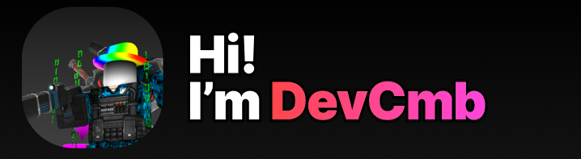

# DevCmb Personal Website
This is my personal website where I show contributions, stats, and a bit about myself

All designs were initially made in Figma! This is my first experience, and I definitely give it a 10/10 for how beginner friendly it is. All files can be found in [the Designs directory](./Designs/)

# Pages
### Home page
The home page shows basic information about me
- Who I am
- How long I've been programming
- Which languages I've done
### Stats page
Wow the only one that actually uses any javascript. All stats are from my [github profile](https://https://github.com/29cmb).
- Stars
- Issues
- Commits
- Pull Requests
### Portfolio Page
Displays all of my interesting projects. Will probably receive the most updates.
- Games
- Tools
- Dev Utilites
- Game Mods

# Contributing
If you'd like to clear out some of the terrible code, feel free to open a pull request!
